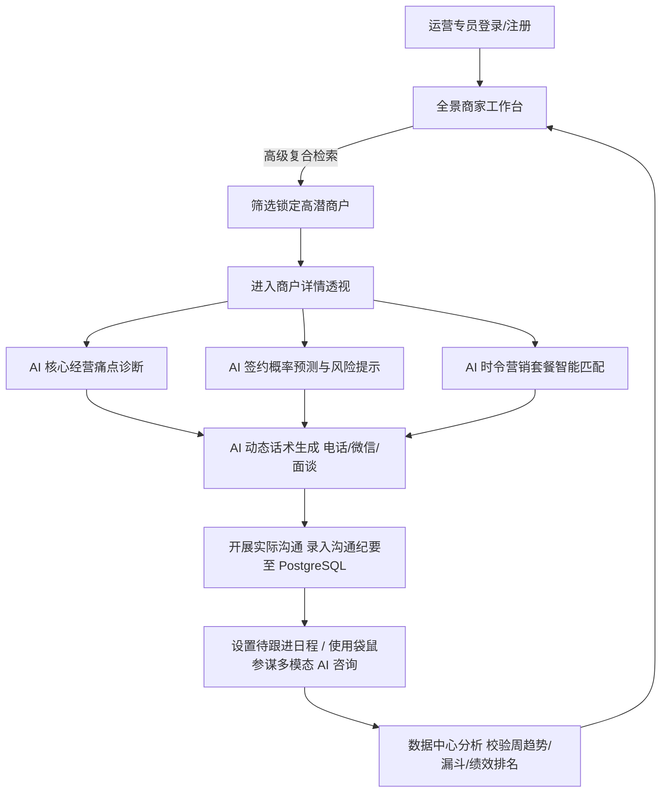

# 🏛️ 美团阿波罗智慧运营平台 (Meituan Apollo)
[](#) [](#) [](#) [](#) [](#) [](#) [](#) [](#) [](#)

## 📋 项目简介

**美团阿波罗 (Meituan Apollo)** 是一款专为本地生活服务（包括餐饮、丽人、酒店旅游、休闲娱乐、亲子教育、运动健身、生活服务及医疗健康等 8 大品类）商户运营团队深度定制的 **AI 驱动型商家智慧运营平台**。系统作为运营人员的智能 Copilot，通过融合商户经营数据诊断、全自动套餐智能匹配、多场景个性化销售话术生成、商户签约接受度预测以及多模态智能对话问答，助力运营专员精准把控商户痛点、提高拜访签约率，实现商机从挖掘到续约的全生命周期高效流转与精细化运营。


---

## 🛠️ 技术栈

### 1. 前端技术栈 (Front-end Stack)
| 技术/依赖库 | 版本 | 应用场景及描述 |
| :--- | :--- | :--- |
| **React** | `^18.0.0` | 核心视图框架，提供高效的组件化声明式开发模式 |
| **TypeScript** | `~5.9.3` | 提供严格的静态类型定义，增强数据流及复杂 AI 对象的健壮性 |
| **Vite / Rolldown**| `rolldown-vite@latest` | 极速打包构建与热更新本地开发服务器，大幅提升迭代效率 |
| **Tailwind CSS** | `^3.4.11` | 原子化样式表，确保在宽屏显示器与移动设备上的高质量响应式表现 |
| **Radix UI** | `latest` | 提供 Dialog, Sheet, Tabs, Select 等无障碍 (A11y) 原生级基础交互组件 |
| **Framer Motion** | `^12.23.25` | 基于 `motion/react` 的高级物理动画库，负责页面转场、手势反馈及微动画交互 |
| **Recharts** | `2.15.4` | 声明式可视化图表库，用于绘制多维趋势图、漏斗图、品类饼图与雷达能力模型 |
| **Lucide React** | `^0.576.0` | 现代化语义化轻量级 SVG 图标集 |
| **React Router** | `^7.9.5` | 客户端 SPA 路由控制器，支持复杂的路由拦截与传参 |
| **Zod & Hook Form**| `^3.25.76` / `^7.66.0` | 运行时数据校验与多维表单系统校验 |

### 2. 后端技术栈 (Back-end Stack)
| 技术/服务组件 | 类别/版本 | 应用场景及描述 |
| :--- | :--- | :--- |
| **Supabase** | `2.103.1` (JS SDK) | 后端即服务 (BaaS) 云端中台，降低服务端维护成本 |
| **PostgreSQL** | `17.6` | 核心关系型数据库，管理运营账户、沟通行为轨迹和系统通知 |
| **Supabase Auth** | JWT 验证机制 | 结合基于邮箱/密码的身份校验，通过安全 Token 判定用户权限会话 |
| **Row Level Security (RLS)** | 行级安全策略 (Policies) | 数据库层强制实施，限制运营专员只能查看和修改自身名下的沟通跟进记录 |
| **Trigger / Functions** | PL/pgSQL 触发器 | `on_auth_user_created` 触发器，在用户注册时自动同步写入 `public.profiles` |

### 3. AI 服务与开发集成 (AI & Dev Integration)
| 技术/模块组件 | 类别/应用原理 | 应用场景及描述 |
| :--- | :--- | :--- |
| **AI Metric & Diagnosis** | 启发式诊断引擎 | 读取商户评分、客单价及月销售变化，在毫秒级内输出具体的痛点成因与缺失营收分析 |
| **Smart Match Engine** | 套餐匹配算法 | 根据品类、时令与诊断出的痛点，自动智能匹配推广流量包、转化提升包并预估 ROI |
| **Acceptance Predictor** | 签约概率推算模型 | 综合接通率、往期签约表现及历史退回频次，量化预测意向百分比分值 |
| **Contextual Script Generator**| 多维度话术生成 | 依据决策老板性格（如价格敏感、效率至上、保守等）输出针对电话、微信、面谈的话术模板 |
| **Kangaroo Chatbot** | 多模态 AI 问答助手 | 提供支持音频录制/播放、图片分析、文件上传及一键经营问答的运营顾问聊天界面 |
| **Miaoda SDK** | 开发平台集成 | 基于 `miaoda-react-devkit` 与 `miaoda-sc-plugin` 套件，进行系统级调试和快速交付 |

---

## 📁 目录结构

```text
Meitx/ (项目根目录)
├── .rules/                    # 规范校验与代码自动检测脚本
├── docs/                      # 业务规划及数据结构设计说明书
├── public/                    # 静态公共资源目录 (图片、Favicon等)
├── supabase/                  # Supabase 本地化开发配置及迁移脚本
│   ├── config.toml            # 本地容器运行端口及组件服务定义
│   ├── schema.sql             # 生产数据库核心表结构、行级安全(RLS)策略与触发器 SQL 脚本
│   └── migrations/            # 数据库变更历史记录
├── src/                       # 前端核心源码
│   ├── components/            # 可复用组件集
│   │   ├── common/            # 通用观察器、错误边界等底层骨架
│   │   ├── layouts/           # 页面主要布局组件 (AppLayout)
│   │   ├── merchant/          # 侧边 AI 智能助手插件 (包含诊断、话术、套餐等卡片组件)
│   │   └── ui/                # 经 Tailwind 装饰的 Radix UI 原子级交互微件 (如对话框、卡片等)
│   ├── contexts/              # 全局 React 上下文
│   │   └── AuthContext.tsx    # Supabase 会话维持及 Profile 用户状态管理中心
│   ├── db/                    # 数据库驱动层
│   │   └── supabase.ts        # 实例化 SupabaseClient 配置文件
│   ├── hooks/                 # 提取公共逻辑的自定义 React Hooks
│   ├── pages/                 # 前端业务核心路由页面
│   │   ├── LandingPage.tsx          # 现代化官网推广页 (支持双排无缝 testimonials 滚动)
│   │   ├── LoginPage.tsx            # 多功能账户登录与注册页
│   │   ├── HomePage.tsx             # 商家工作台主页 (包含四大 KPI 指标卡与重点商家推荐)
│   │   ├── DataCenterPage.tsx       # 可视化数据中心 (营收、转化漏斗、雷达能力等多表联动)
│   │   ├── MerchantManagementPage.tsx # 商户总览名录及全量生命周期管理
│   │   ├── MerchantDetailPage.tsx   # 商户透视大盘 (完美整合环境相册与 AI 侧滑助手)
│   │   ├── MerchantFilterPage.tsx   # 高级组合筛选器 (多条件复合式检索高价值商户)
│   │   ├── PackageRecommendationPage.tsx # 智能营销套餐匹配大盘 (按商户/套餐总览展示)
│   │   ├── AcceptancePredictionPage.tsx  # 签约接受度评分走势及签约转化分布大盘
│   │   ├── CommunicationPage.tsx    # 沟通纪要CRUD、待办清单及袋鼠参谋 AI 对话助手
│   │   └── SettingsPage.tsx         # 个人中心及运营辖区资料配置页
│   ├── services/              # 业务数据及外部 API 对接层
│   │   └── mockData.ts        # 模拟 AI 核心算法模型及全量模拟数据生成
│   ├── types/                 # 全局 TypeScript 规范定义
│   │   └── merchant.ts        # 商家、套餐、话术、沟通日志等底层数据 Interface 实体定义
│   ├── App.tsx                # 应用路由根配置与 Sonner 全局挂载
│   ├── main.tsx               # 前端主启动入口
│   ├── routes.tsx             # 页面路由声明定义清单
│   └── index.css              # 主题样式变量、动画及 Tailwind 自定义基准色定义
├── tailwind.config.js         # Tailwind 主题动画、自定义 HSL 调色板及容器配置
├── tsconfig.json              # TypeScript 全局编译校验规则
├── vite.config.ts             # Vite 路径别名（@）及 Rolldown 编译器挂载配置
└── package.json               # 项目包管理、Lint 命令与项目依赖依赖管理表
```

---

## ⚡ 核心功能模块和工作流程



### 1. 营销推广官网与统一鉴权 (Landing & Auth)
*   **高保真引流首页**：搭载丰富的 HSL 渐变与三维感知微交互，拥有**双排反向无限滚动 testimonials 用户反馈墙**、支持交互式实时数字累加计数器和动态报价选项卡。
*   **统一账户中心**：底层无缝集成 Supabase Auth。用户注册时输入用户名后，系统自动映射拼接虚拟邮箱后缀（例如 `${username}@miaoda.com`），确保组织统一管理；且通过数据库触发器将凭证数据同步写入 `public.profiles` 信息表。

### 2. 核心工作台与高潜筛选 (Workbench & Filtration)
*   **今日跟进 KPI 大盘**：汇总今日需跟进商户、本月累计签约、待处理沟通与高潜商家池四维度数据，直观标识环比升降。
*   **高级商家筛选器**：支持按月销售区间、特定品类、接通概率、意向梯度以及关键词的组合式交叉筛选，帮助运营人员迅速过滤无关干扰，定位当日关键拜访对象。

### 3. AI 经营诊断与套餐匹配 (Diagnosis & Recommendation)
*   **三维痛点诊断**：读取商户实际数据，深度剖析并锁定如“销售额环比下滑”、“客单价低于商圈均值”或“门店星级偏低”等痛点，详述诱发原因、测算月流失营收及数据源追溯。
*   **增收套餐推荐**：系统依据诊断结果，匹配相对应的推广方案（如“曝光提升计划·Pro”或“套餐组合增收包”），明确展现预估订单提升百分比、销售增长幅度及预计 ROI。

### 4. 签约预测与时令洞察 (Prediction & Seasonal Insight)
*   **接受度评分 (0-100)**：综合往期多次触达反馈，给出具体分值。针对高、中、低三个档次，输出对应的执行策略与**风险预警**（如“竞品严重分流，建议加快上线节奏”）。
*   **季节性经营机会**：按不同品类挖掘当前时令（如“暑期/夜宵旺季”）的搜索增长空间，并列出本周短周期行动建议。

### 5. 个性化话术生成 (Smart Sales Scripts)
*   **主导者性格匹配**：针对不同的商家老板画像（价格敏感、效率至上、时间宝贵、决策保守、愿意尝试新事物），AI 调整切入角度。
*   **三场景动态话术**：一键生成**电话沟通**（点明事实）、**微信沟通**（简短高能）与**面谈拜访**（深度剖析）三个维度的话术文案，并标记建议沟通时长和切入要点。

### 6. 沟通全闭环与待办日程 (Tracking & Schedule)
*   **沟通纪要 CRUD**：运营人员跟进完毕后，快速录入表单。内容输入框集成了**轻量级富文本编辑器**，支持文本加粗、斜体、无序/有序列表、引用及超链接的录入，记录直接同步存盘。
*   **跟进日程看板**：记录待跟进商户、时间点及优先级，任务完成时支持一键快捷勾选归档。

### 7. 袋鼠参谋多模态 AI 对话助手 (Kangaroo Advisor)
*   **多模态交互**：内嵌智能聊天助手，支持输入文字并提供模拟麦克风音频录音、语音消息快捷播放、经营图片分析及项目文档附件上传等功能。
*   **一键式运营诊断**：配备快捷提问标签，支持一键发送“AI营销诊断”、“数据解读”、“选址建议”和“菜品研发”等请求，AI 结合商圈大盘给出精确运营报告。

### 8. 可视化数据中心 (Data Center)
*   **多维 Recharts 联动大盘**：
    *   **销售趋势**：渐变面积图联动展示实际月营收 vs 目标额度。
    *   **转化漏斗**：展示“商家池 → 已触达 → 有意向 → 已签约 → 复购中”的完整漏斗。
    *   **能力分析**：使用雷达能力模型图对比当前团队与行业均值在 6 个维度的优劣势。
    *   **绩效排行榜**：分别呈现商户月度营收排行与运营专员团队绩效排行，营造积极跟进氛围。

---

## ⚙️ 部署指南

### 1. 前置条件 (Prerequisites)
请确保您的 Windows 本地系统已安装：
*   **Node.js**: `≥ v20.0.0` (推荐版本 `v20.18.3`)
*   **npm**: `≥ v10.0.0` (或使用 `pnpm`)

### 2. 环境变量配置文件 (.env)
在项目根目录下，将 `.env` 配置文件修改或配置为真实的 Supabase 数据库服务地址：
```env
VITE_SUPABASE_URL=https://your-supabase-project-id.supabase.co
VITE_SUPABASE_ANON_KEY=eyJhbGciOiJIUzI1NiIsInR5cCI6IkpXVCJ9...your-anon-key
```

### 3. 安装与运行指令
打开 IDE 终端或 Windows PowerShell，按顺序执行以下指令：
```powershell
# 1. 安装项目所有依赖库 (使用 pnpm 或 npm)
pnpm install

# 2. 启动本地 Vite 开发服务器，监听 127.0.0.1 端口
pnpm run dev -- --host 127.0.0.1
```
控制台输出成功后，在浏览器中打开：`http://127.0.0.1:5173`。

### 4. Supabase 数据库建表初始化
如果您需运行完整的登录及沟通记录入库功能，请在 Supabase 后台 SQL 运行器中执行项目 `supabase/schema.sql` 脚本，该脚本会自动：
1. 创建 `user_role` 枚举类型。
2. 创建 `profiles` (用户信息表)、`communications` (沟通流水表)、`notifications` (系统通知表)。
3. 创建行级安全防护 (RLS) 策略，并为各个业务角色赋予专属读取/插入权限。
4. 注册 `handle_new_user` 触发器到 Auth 系统，实现新用户同步激活。

---

## 📦 API 接口与数据表结构

本项目底层通过 Supabase 暴露的 RESTful/PostgREST 接口，直接与 PostgreSQL 数据库交互，遵循严格的 RLS 安全策略。以下为系统的核心数据表及字段映射说明：

### 1. 运营专员用户信息表 (`public.profiles`)
用于同步和储存通过认证的内部运营人员的基本职务及管辖商圈信息。
> [!NOTE]
> 该表启用了行级安全策略（RLS），任何经过身份认证的用户仅能编辑自身的 profile，大区经理 (manager) 及管理员 (admin) 拥有额外的只读/读取策略。

| 字段名称 (Column) | 数据类型 (Type) | 约束条件 (Constraint) | 字段含义与描述 |
| :--- | :--- | :--- | :--- |
| `id` | `uuid` | `PRIMARY KEY`, 关联 `auth.users.id` | 用户唯一标识，由 Auth 触发函数自动生成同步 |
| `email` | `text` | 可为空 | 用户的登录电子邮箱 |
| `phone` | `text` | 可为空 | 用户联系手机号 |
| `username` | `text` | `UNIQUE` | 账户登录的唯一用户名 |
| `display_name` | `text` | 可为空 | 系统前端显示的运营顾问昵称 |
| `avatar_url` | `text` | 可为空 | 头像文件存储链接 |
| `role` | `public.user_role` | `NOT NULL`, `DEFAULT 'user'` | 账户级别：`user` (普通运营), `manager` (主管), `admin` (系统管理员) |
| `department` | `text` | 可为空 | 所属工作部门或业务组 (如：餐饮运营一部) |
| `region` | `text` | 可为空 | 所辖商区或核心城市 (如：华东大区) |
| `created_at` | `timestamptz` | `NOT NULL`, `DEFAULT now()` | 账号自动同步时间 |
| `updated_at` | `timestamptz` | `NOT NULL`, `DEFAULT now()` | 账号最后一次资料修改时间 |

### 2. 业务沟通日志表 (`public.communications`)
记录运营人员对商户进行的历次拜访或电话、微信跟进的详尽纪要与意向成效。
> [!IMPORTANT]
> 该表 RLS 策略只允许 authenticated 用户插入和修改其自身所操作的记录（即 `auth.uid() = operator_id`），防止跨人越权修改。

| 字段名称 (Column) | 数据类型 (Type) | 约束条件 (Constraint) | 字段含义与描述 |
| :--- | :--- | :--- | :--- |
| `id` | `uuid` | `PRIMARY KEY`, `DEFAULT gen_random_uuid()` | 沟通日志的唯一流水主键 |
| `merchant_id` | `text` | `NOT NULL` | 关联商户的代码/ID |
| `merchant_name` | `text` | `NOT NULL` | 商户店铺名称 |
| `operator_id` | `uuid` | 外键, 关联 `public.profiles.id` | 执行跟进的运营人员唯一 ID |
| `channel` | `text` | `NOT NULL`, 见约束 `CHECK` | 触达场景限制：`phone` (电话), `wechat` (微信), `face_to_face` (面谈), `email` (邮件) |
| `duration_minutes`| `integer` | 可为空 | 洽谈或沟通时长（分钟） |
| `content` | `text` | `NOT NULL` | 沟通内容纪要，存储经富文本编辑器修改的 HTML 或纯文本 |
| `result` | `text` | 可为空, 见约束 `CHECK` | 沟通结果限制：`connected` (已接通), `no_answer` (未接听), `rejected` (已拒绝), `signed` (已签约), `follow_up` (待跟进) |
| `notes` | `text` | 可为空 | 额外需要备注的信息 |
| `contact_time` | `timestamptz` | `NOT NULL`, `DEFAULT now()` | 实际开展沟通与随访的时间点 |
| `created_at` | `timestamptz` | `NOT NULL`, `DEFAULT now()` | 数据创建时间 |

### 3. 系统通知消息表 (`public.notifications`)
推送经营异动预警、签约成功提示等实时通知的全局汇总表。
> [!TIP]
> RLS 策略限定了当前登录的认证用户仅能检索属于自身 `user_id` 的通知项。

| 字段名称 (Column) | 数据类型 (Type) | 约束条件 (Constraint) | 字段含义与描述 |
| :--- | :--- | :--- | :--- |
| `id` | `uuid` | `PRIMARY KEY`, `DEFAULT gen_random_uuid()` | 通知唯一标识 ID |
| `user_id` | `uuid` | 外键, 关联 `public.profiles.id`, 级联删除 | 接收此条通知的内部用户 ID |
| `title` | `text` | `NOT NULL` | 通知主题 |
| `content` | `text` | `NOT NULL` | 通知详细正文 |
| `type` | `text` | `NOT NULL`, `DEFAULT 'info'`, `CHECK` | 消息级别：`info` (常规), `warning` (预警), `success` (成功), `error` (异常) |
| `is_read` | `boolean` | `NOT NULL`, `DEFAULT false` | 标识用户是否已经阅读本条通知 |
| `created_at` | `timestamptz` | `NOT NULL`, `DEFAULT now()` | 通知创建并派发的时间 |

---

## 💡 总结与展望

### 1. 核心价值总结 (System Strengths)
*   **AI 赋能业务封闭环路**：该项目打通了本地生活运营“**商户筛选 → 全盘诊断 → 签约预测 → 精准匹配套餐 → 多场景话术辅助 → 沟通跟踪 → 数据分析复盘**”的精细化漏斗闭环。
*   **高品质交互与体验**：前端在 Tailwind CSS 3.4 颜色体系上拓展了更具品质的 HSL 配色，融合 Radix UI 与 Framer Motion。包含双排无缝 testimonials 反向滚动、三维感知悬停面板等卡片交互，提供极高保真的交互设计体验。
*   **完备的安全管控**：基于 Supabase PostgreSQL 深度实现权限管控，在数据库核心表中开启行级安全防护 (RLS)，确保多租户或多角色运营顾问数据的物理隔离，防止数据越权外泄。

### 2. 未来发展规划 (Roadmap & Outlook)
*   **集成大语言模型 (LLM) API**：将前端 Mock 对话问答与文本生成引擎接入真实的 LLM 接口，依据现场沟通录音或商户经营背景自动生成精准且契合场景的商谈话术。
*   **数据平台双向打通**：与美团/大众点评商户开放平台 (MOP) 对接，实现销量数据流水、用户最新负面点评等实时回传，让 AI 经营痛点诊断结果更具时效性与说服力。
*   **VoIP 语音直拨与智能录音转写**：实现系统内一键拨打商家虚拟保护号码进行沟通，并且自动将通话音频录制后通过 Whisper 引擎转写为纯文本纪要存入数据库，进一步减轻运营专员的日常表单填写工作。
