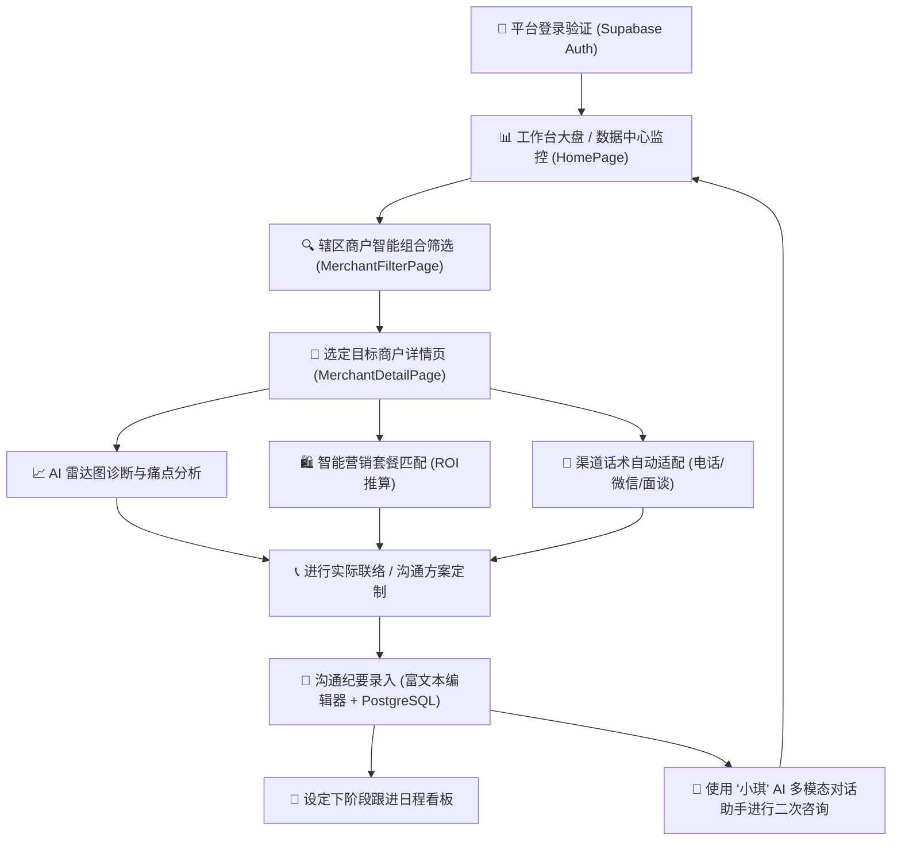

# 🧁 美团阿波罗智慧运营AI平台  (Meituan Apollo)
[](https://react.dev/) [](https://www.typescriptlang.org/) [](https://vitejs.dev/) [](https://tailwindcss.com/) [](https://supabase.com/) [](https://www.postgresql.org/) [](https://www.deepseek.com/)

## 📋 项目简介

**美团阿波罗智慧运营平台** 是一个专为餐饮、丽人、休闲娱乐、酒店旅游等生活服务类商家打造的智能数字化运营管理后台。系统深度对接了基于 **DeepSeek-v4-Pro** 架构的“小琪”多模态 AI 对话顾问，通过对商户端销售额、接通率、客单价等核心经营指标进行大数据诊断，自动定位经营痛点，自动匹配最佳营销套餐与异议沟通话术。全面赋能平台销售与运营专家实现高效的商户跟进与签约转化。

---

## 🛠️ 技术栈

### 🖥️ 前端技术栈 (Front-end Stack)
| 组件/框架 | 选型版本 | 说明 |
| :--- | :--- | :--- |
| **核心框架** | React 18.0.0 | 组件化 UI 开发，状态驱动视图渲染 |
| **开发构建** | Vite 5.1.4 | 极速的热重载与生产打包构建，现代 ESM 支持 |
| **编程语言** | TypeScript ~5.9.3 | 强类型约束，提升代码健壮性与团队协作效率 |
| **样式方案** | Tailwind CSS 3.4.11 | 原子化样式体系，加速高保真响应式布局开发 |
| **交互动画** | Framer Motion 12.2.x | 丝滑的 UI 过渡及卡片展开微交互动画 |
| **基础组件** | Radix UI (Shadcn/ui) | 提供 Tabs、Dialog、Select、Sheet 等高可访问性无样式底层组件 |
| **数据可视化** | Recharts 2.15.4 | 响应式折线图、条形图与商户诊断雷达图渲染 |
| **图标库** | Lucide React | 提供一致性、现代化矢量图标支持 |
| **路由管理** | React Router 7.9.5 | 声明式前端多路由匹配及鉴权中间件 |
| **表单与校验**| React Hook Form & Zod | 高性能表单状态管理与严格的前端数据格式Schema校验 |

### 🗄️ 后端及数据库 (Back-end & BaaS)
| 服务组件 | 服务选型 | 说明 |
| :--- | :--- | :--- |
| **BaaS 平台** | Supabase | 提供开箱即用的 Auth 认证、实时 PostgreSQL 数据源及云函数 API |
| **云端数据库** | PostgreSQL 17.6 | 存储用户 Profile、跟进纪要及系统消息通知，原生支持 JSONB 数据格式 |
| **数据隔离** | Row Level Security (RLS) | PostgreSQL 行级安全策略，限制非授权用户跨辖区/跨层级越权访问 |
| **数据同步** | Auth Triggers / Functions | 监听用户注册并自动触发存储过程同步写入 `profiles` 基本资料表 |

### 🤖 AI 服务架构 (AI Services)
| 核心模块 | 模型与接入方式 | 说明 |
| :--- | :--- | :--- |
| **对话大模型** | DeepSeek-v4-Pro | 智能诊断经营数据，通过 System Prompt 深度重塑“小琪”人格化定位 |
| **流式传输** | SSE (Server-Sent Events) | 在对话面板中实现打字机式流式数据输出，提供流畅交互 |
| **API 接入** | 反向代理 Proxy API | 内部代理地址 `/api/innoreation/v1/proxy/chat/completions` 进行安全鉴权 |
| **多模态能力** | 模拟多模态输入 | 提供虚拟麦克风录音播放、经营图片分析与项目文档上传等演示交互 |

---

## 📁 目录结构

```text
e:\Code\AI\Start\Web\Learn\Meitx\
├── .env                        # 本地环境变量配置文件 (保存 API Key 及 Supabase 密钥)
├── package.json                # 依赖管理及构建脚本定义
├── tailwind.config.js          # Tailwind CSS 配置文件
├── tsconfig.json               # TypeScript 编译器配置文件
├── vite.config.ts              # Vite 构建与开发服务器配置文件
├── .rules/                     # 自动化检查规则与测试脚本
├── docs/                       # 系统架构、开发手册等静态参考文档
├── public/                     # 静态资源存放目录
│   ├── favicon.png             # 平台官方 Favicon 标识
│   └── person.jpg              # AI 助手“小琪”的官方展示头像
├── supabase/                   # Supabase 数据库配置文件及迁移脚本
│   ├── config.toml             # Supabase 项目本地配置
│   └── schema.sql              # 云端 PostgreSQL 数据库物理模型与触发器 SQL
└── src/                        # 前端 React 核心源代码
    ├── App.tsx                 # 应用程序根节点与全局上下文注入
    ├── main.tsx                # 应用渲染入口文件
    ├── routes.tsx              # 前端路由控制中心 (包含登录鉴权保护路由)
    ├── index.css               # 全局样式文件与 Tailwind 指令
    ├── components/             # 可复用业务与通用组件
    │   ├── ui/                 # 原子化基础 UI 组件 (Shadcn/ui Radix 封装)
    │   └── merchant/           # 商户专属智能卡片组件
    │       ├── AIPluginPanel.tsx       # AI 智能侧边栏大面板 (诊断、推荐、话术)
    │       ├── MerchantDataCard.tsx    # 门店基础数据汇总卡片
    │       ├── PainPointCard.tsx       # 门店核心痛点剖析卡片
    │       ├── PackageRecommendation.tsx # 时令营销套餐推荐卡片
    │       ├── AcceptancePrediction.tsx # 签约意向接受度预测卡片
    │       ├── ScriptGenerator.tsx     # 跨渠道（微信/电话/面谈）话术生成器
    │       └── SeasonalInsight.tsx     # 季节时令洞察建议卡片
    ├── contexts/               # 全局 Context 状态管理器
    │   └── AuthContext.tsx     # 用户登录鉴权状态全局订阅 (Supabase Auth)
    ├── db/                     # 数据库交互驱动
    │   └── supabase.ts         # Supabase Client 实例初始化与封装
    ├── hooks/                  # 自定义 React Hooks
    │   └── useMobile.ts        # 移动端/桌面端屏幕分辨率自适应判定
    ├── pages/                  # 页面级视图组件
    │   ├── LandingPage.tsx             # 平台官方高保真推广着陆页
    │   ├── LoginPage.tsx               # 平台统一账号登录/注册验证页
    │   ├── HomePage.tsx                # 销售运营个人工作台大盘
    │   ├── DataCenterPage.tsx          # 运营数据监控与分析中心 (折线图/条形图大屏)
    │   ├── MerchantManagementPage.tsx  # 辖区内商户档案管理主表 (CRUD、匹配检索)
    │   ├── MerchantDetailPage.tsx      # 商户经营细节详情页 (包含 AIPlugin 挂载)
    │   ├── MerchantFilterPage.tsx      # 组合式高价值商户漏斗筛选器
    │   ├── PackageRecommendationPage.tsx # 智能营销套餐匹配大盘 (全局视图)
    │   ├── AcceptancePredictionPage.tsx  # 签约接受度趋势及待跟进商户汇总看板
    │   ├── CommunicationPage.tsx       # 沟通方案核心页 (包含沟通纪要CRUD与“小琪”对话助手)
    │   └── SettingsPage.tsx            # 个人设置及辖区信息配置页
    ├── services/               # 业务逻辑与 API 对接层
    │   ├── mockData.ts         # 本地 Mock 数据生成器、分析算法及 LocalStorage 同步器
    │   └── ai/
    │       └── deepseek.ts     # DeepSeek-v4-Pro SSE 流式对话接口封装
    └── types/                  # 全局 TypeScript 接口声明
        └── merchant.ts         # 商户、套餐、话术、纪要、日程等类型定义
```

---

## ⚡ 核心功能模块和工作流程
### 🌀 系统整体运作流图 (Mermaid Diagram)


### 1️⃣ 用户身份与行级安全体系 (Auth & RLS)
用户通过 `LoginPage` 登录后，由 `AuthContext` 监听到 Session 变化，将用户信息及 Role（`user` / `manager` / `admin`）保存至全局。每次数据库请求均携带 JWT 校验，Supabase 根据 `schema.sql` 中定义的策略（Policies）确保：
* 销售运营人员仅可更新和维护自己创建的沟通纪要（`operator_id = auth.uid()`）。
* 运营经理（`manager`）与超级管理员（`admin`）才具备跨区域查看其他运营人员资料的权限。

### 2️⃣ 商家多维筛选漏斗 (Merchant Filter)
在 `MerchantFilterPage` 中，系统提供了一套高级组合式检索模型。它通过本地分析算法对商户列表进行加工过滤，能够实现：
* **销售业绩区间筛选**：按月营业额高低精准分类。
* **签约倾向漏斗**：自动将商户按潜在签约评分从高到低排序，锁定“高转化”商户。
* **品类及接通率筛选**：重点筛选出接通率高于均值（例如 70%）的高互动频次商家。

### 3️⃣ 门店经营诊断与套餐推荐 (Diagnostics & Pitching)
点击进入 `MerchantDetailPage` 时，AI 智能侧边栏 `AIPluginPanel` 将自动分析该店经营数据：
* **雷达图诊断**：展现该商户与所在商圈 Top 10% 标杆商家的差距。
* **痛点定位**：分析是否由于评分过低、客单价低于均值或高峰期产能受限带来营收流失。
* **套餐匹配**：自动匹配“曝光提升计划 Pro”或“客单价增收包”，并给出预期 ROI 及预期订单提升率。
* **个性化话术**：基于老板性格风格（如“价格敏感”、“效率至上”），针对电话、微信、面谈三种媒介生成极具说服力的沟通脚本。

### 4️⃣ “小琪” AI 运营助理与流式对话 (Xiaoqi Assistant)
在 `CommunicationPage` 中，用户可与 “小琪” 展开深度对话：
* **智能初始化**：进入后左侧展示助理官方头像（`person.jpg`），并亲切问候：“老板，你好！我是小琪。我可以为您提供全链路的智能建议服务。”。
* **运营技能包装**：提供“流失客户精准关怀召回”、“竞品降维打击曝光”等多个高阶技能卡片，启用后在后台直接把特定的 Prompt 模板和商家数据拼接入 System Prompt。
* **多模态问答演示**：支持文字发送、模拟麦克风录音、微信式语音播放、项目文档上传以及一键式雷达图分析。

### 5️⃣ 销售跟进闭环流程
运营人员在使用话术进行跟进后，可以直接在后台录入沟通日志。在本地无网或测试状态下，系统优先使用 `localStorage` 作双向数据缓存；而在云端就绪时，一键同步至 PostgreSQL 云端数据库，同时触发日程看板将后续跟进任务推入跟进清单。

---

## ⚙️ 部署指南

### 1. 软件环境准备
* **Runtime**: Node.js (推荐 18.x 或更高版本)
* **Package Manager**: npm 9.x+ (或 pnpm / yarn)
* **Database**: Supabase 账户 (可选，本地有完整的 Mock 状态及 LocalStorage 双缓存支持)

### 2. 克隆项目与依赖安装
打开终端，进入项目工作空间执行以下命令：
```powershell
# 1. 安装项目所有相关前端依赖包
npm install

# 2. 对 TypeScript 文件执行无输出类型验证，确保项目符合编译标准
npx tsc --noEmit
```

### 3. 配置环境变量
在项目根目录下，新建或编辑 `.env` 文件，输入以下环境配置：
```ini
# Supabase 云端/本地 BaaS 服务连接地址及匿名 Public Key
VITE_SUPABASE_URL=https://your-supabase-project-id.supabase.co
VITE_SUPABASE_ANON_KEY=eyJhbGciOiJIUzI1NiIsInR5cCI6IkpXVCJ9...

# 内部大模型接口鉴权 API KEY (默认为系统配置的内置代理 Key)
VITE_PROXY_API_KEY=sk-02260d10c28c4bb4b65bace15ba5f754
```

### 4. 运行本地开发服务器
执行以下命令启动 Vite 热开发服务器：
```powershell
# 启动本地开发服务，默认挂载于 http://localhost:5173
npm run dev
```

### 5. 编译及代码规范检查
部署至生产环境前，建议执行代码检查：
```powershell
# 进行 TypeScript 规范检查、样式分析以及最终的 Vite 编译打包
npm run lint

# 进行 Vite 生产环境编译压缩构建
npm run build
```

---

## 📦 API 接口 & 数据模型

### 📡 外部 AI 代理接口 (DeepSeek API Endpoint)
本系统采用流式 SSE (Server-Sent Events) 与 DeepSeek 后端交互，接口配置信息如下：
* **URL**: `/api/innoreation/v1/proxy/chat/completions` (前端反向代理配置)
* **Method**: `POST`
* **Headers**:
  ```json
  {
    "Content-Type": "application/json",
    "Proxy-API-Key": "VITE_PROXY_API_KEY",
    "X-Proxy-Key": "VITE_PROXY_API_KEY"
  }
  ```
* **Request Body**:
  ```json
  {
    "model": "deepseek-v4-pro",
    "messages": [
      { "role": "system", "content": "System Prompt Content..." },
      { "role": "user", "content": "用户的问题..." }
    ],
    "temperature": 0.7,
    "stream": true
  }
  ```

### 🗃️ 数据库物理结构 (Database Tables)
项目底层由 PostgreSQL 构建，包含以下三大主表：

#### 1. `public.profiles` (用户资料表)
保存平台销售与运营专家信息，与 Auth 模块的 `auth.users` 表通过 `id` 建立一对一外键关联。
| 字段名称 | 物理类型 | 约束条件 | 描述 |
| :--- | :--- | :--- | :--- |
| `id` | `uuid` | PRIMARY KEY, FK to `auth.users` | 用户唯一主键标识 |
| `email` | `text` | Nullable | 登录邮箱地址 |
| `phone` | `text` | Nullable | 联络手机号码 |
| `username` | `text` | UNIQUE | 登录账号名 |
| `display_name`| `text` | Nullable | 展示中文姓名 |
| `avatar_url` | `text` | Nullable | 个人头像静态存储地址 |
| `role` | `public.user_role`| DEFAULT 'user' | 角色角色（`user` / `manager` / `admin`） |
| `department` | `text` | Nullable | 所属运营部门 |
| `region` | `text` | Nullable | 管辖所属地区/商圈 |
| `created_at` | `timestamptz` | DEFAULT now() | 账号注册创建时间 |
| `updated_at` | `timestamptz` | DEFAULT now() | 资料最近更新时间 |

#### 2. `public.communications` (跟进沟通纪要表)
保存销售运营对生活服务商户开展的电话、微信及面谈等跟进记录。
| 字段名称 | 物理类型 | 约束条件 | 描述 |
| :--- | :--- | :--- | :--- |
| `id` | `uuid` | PRIMARY KEY, DEFAULT gen_random_uuid() | 纪要唯一主键 |
| `merchant_id` | `text` | NOT NULL | 目标跟进商户唯一 ID |
| `merchant_name`| `text` | NOT NULL | 目标商户店铺名称 |
| `operator_id` | `uuid` | FK to `public.profiles` | 创建此纪要的销售/运营人员 ID |
| `channel` | `text` | CHECK ('phone', 'wechat', 'face_to_face', 'email') | 沟通媒介渠道 |
| `duration_minutes`| `integer` | Nullable | 电话/面谈沟通时长(分钟) |
| `content` | `text` | NOT NULL | 沟通核心纪要 (支持轻量级 HTML 富文本) |
| `result` | `text` | CHECK ('connected', 'no_answer', 'rejected', 'signed', 'follow_up') | 沟通最终状态结果 |
| `notes` | `text` | Nullable | 备注及下次跟进核心方向建议 |
| `contact_time`| `timestamptz` | DEFAULT now() | 实际开展沟通的时间点 |
| `created_at` | `timestamptz` | DEFAULT now() | 纪要入库创建时间 |

#### 3. `public.notifications` (系统消息通知表)
向特定销售运营人员分发的提示及代办预警通知。
| 字段名称 | 物理类型 | 约束条件 | 描述 |
| :--- | :--- | :--- | :--- |
| `id` | `uuid` | PRIMARY KEY, DEFAULT gen_random_uuid() | 通知唯一主键 |
| `user_id` | `uuid` | FK to `public.profiles` | 接收通知的目标用户 ID |
| `title` | `text` | NOT NULL | 通知标题 |
| `content` | `text` | NOT NULL | 通知正文详情 |
| `type` | `text` | CHECK ('info', 'warning', 'success', 'error') | 通知类型分级 |
| `is_read` | `boolean` | DEFAULT false | 通知是否已读状态 |
| `created_at` | `timestamptz` | DEFAULT now() | 通知分发时间 |

---

## 💡 总结与展望

### 🌟 项目核心价值
美团阿波罗智慧运营平台成功地将 **传统表格化商户管理** 升级为了 **“AI 大数据智能诊断 -> 沟通方案全套定制 -> 全流程数据闭环跟进”** 的智慧化销售闭环模式。系统引入“小琪”这一拟人化多模态 AI 运营顾问角色，有效解决了平台运营新手“不会诊断、不会匹配套餐、不会应对老板异议”三大痛点，降低了员工培训难度，极大拉动了美团广告、流量包及转化方案的转化效能。

### 🚀 平台未来展望规划
* **🎙️ 深度语音合成交互 (TTS/STT Integration)**：在后续版本中，计划将“小琪”的语音播放升级为基于真实语音特征库合成的智能拟真客服人声，运营人员可直接通过小琪进行模拟电话对练演练。
* **🗳️ 批量托管智能诊断 (Batch Diagnostic Agent)**：开发自动化定时器，每逢周一自动对管辖区域内异常波动的数十家商户进行批量痛点诊断，自动把包含痛点、对应套餐、ROI 预测报告以工作通知（Notification）形式精准派发到销售手机端。
* **📖 增强版 RAG 运营知识库 (Apollo RAG Engine)**：引入向量数据库（Vector DB），将美团官方运营白皮书、过往高价值签约成功案例、常见客诉应答手册等知识文件进行切片与向量化导入。使得“小琪”在应对运营人员复杂问题时，能够基于事实文献给出百分之百准确且带有出处指引的专业策略。
